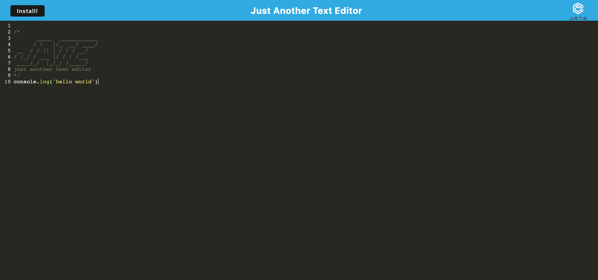

# JATE Text Editor

## Description
JATE (Just Another Text Editor) is a web application that provides a simple and efficient text editing experience while leveraging modern web technologies. This README will guide you through the setup of JATE.

## Table of Contents
* [Installation](#installation)
* [Usage](#usage)
* [Technologies Used](#technologies-used)
* [Contributions](#contributions)
* [Visuals](#visuals)
* [License](#license)
* [Questions](#questions)

## Installation
To install the application, clone the repository and run `npm install` or `npm i` to install the required dependencies.

To install JATE as a desktop app, click the "Install" button within the application or click the install button within the address bar.

## Usage
To start the JATE application, run the command `npm run start` from the root directory

## Technologies Used
* Babel
* Workbox
* Webpack
* IndexedDB

## Contributions
This project is not open to contributions at this time.

## Visuals

## License
This application is covered under the MIT license.

## Questions
If you have any questions about this application feel free to reach out:
* GitHub: [brady-billeisen](https://github.com/brady-billeisen)

* Email: [bradybill32@gmail.com](mailto:bradybill32@gmail.com)